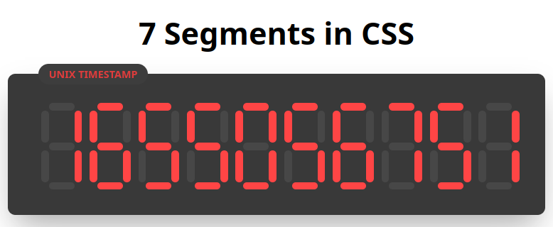

# 7SegmentCSS

> <b>✍️ Author:</b> Osamu-KJ (Kevin J)

Web development challenge where you have to translate a number from 0-9 into a CSS element that's formatted as a 7 segment digit. Project is built on top of React JS which is a Javascript framework and Google cloud (<b>used for hosting the website which you can visit yourself <a href="https://segmentcsshosting.web.app/">at this link</a></b>)

